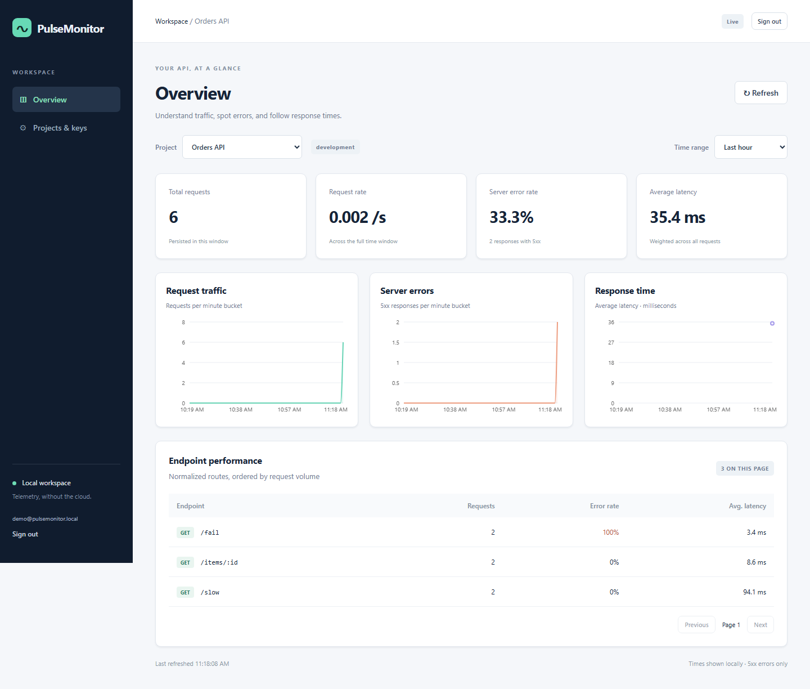

# PulseMonitor

A local telemetry analytics platform for Express APIs. Capture requests with a small SDK, process batches asynchronously, and explore traffic, errors and latency in a live React dashboard. No cloud accounts or hosted services are required.



## Technology

| Layer | Tools |
| --- | --- |
| Frontend | React, TypeScript, Vite, Recharts, CSS |
| API and SDK | Node.js, Express 5, TypeScript, Zod |
| Storage | PostgreSQL, Prisma migrations/client |
| Background processing | Redis, BullMQ, ioredis |
| Live updates | Socket.IO, Redis Pub/Sub |
| Authentication | Argon2 passwords, hashed cookie sessions, hashed/revocable API keys |
| Packaging | Docker Compose, Nginx |
| Verification | Node test runner, Vitest, Testing Library, Playwright, GitHub Actions |

## What it does

- Authenticated project creation/selection and API-key creation/revocation.
- Request counts, requests/sec, 5xx error percentages and average response times.
- Minute charts, time filters, endpoint pagination, loading/empty/error states and responsive layouts.
- Bounded SDK batching and retries; authenticated ingestion; an independent worker with duplicate-safe PostgreSQL writes.
- Authorized live notifications after database commits, with REST refresh after reconnect.

```text
Your Express API -> SDK buffer -> HTTP batch -> ingestion API
                 -> Redis/BullMQ -> worker -> PostgreSQL
                                          -> Redis Pub/Sub
                                          -> Socket.IO -> dashboard REST refresh
```

HTTP **202 means queued**, not saved. Database uniqueness on project/event ID prevents duplicate rows when retries replay an event.

## Local setup

Prerequisites: Node.js 22.12+ and Docker Desktop running Linux containers. Initial downloads require internet; the running application uses your laptop's resources.

```sh
git clone https://github.com/charan11w/pulse-monitor.git
cd pulse-monitor
git switch charan-dev
cd backend
npm ci
npm run db:init
cd ..
docker compose -f compose.app.yaml up -d --build --wait
```

Open **http://localhost:5173**. Sign in as `demo@pulsemonitor.local`, using `SEED_PASSWORD` from the generated root `.env`. Keep this file private. `db:init` preserves an existing file. Initialization applies migrations and an idempotent seed before starting the API/worker.

The full app has separate volumes from the host-development `compose.yaml`. PostgreSQL and Redis are internal; frontend/API ports bind to localhost. Set `APP_PORT` or `API_PORT` in root `.env` if defaults 5173/3000 conflict. Use `localhost` for the browser's configured origin.

### Built-in demo

```sh
docker compose -f compose.app.yaml --profile demo up -d demo
docker compose -f compose.app.yaml exec demo node dist/demo/run-traffic.js
```

Select **Demo API → Last hour** in the dashboard. The command generates 30 requests: ten normal, ten slow and ten intentional 500 responses. Charts refresh after processing. This is finite synthetic demo traffic, not a throughput benchmark.

### Use the SDK in another project

The SDK supports a **Node.js Express 5 backend**, not browser-only React code. It is locally installable; it is **not published to npm**. Never put an ingestion key in frontend code or a `VITE_*` variable.

1. Start PulseMonitor. In **Projects & keys**, create a project for your other API and create an API key. Copy the raw key when shown; it appears only once.
2. Build the SDK archive from this clone (run `npm ci` in `backend` first):

   ```sh
   cd sdk
   npm pack
   ```

   This creates `sdk/pulsemonitor-express-sdk-0.1.0.tgz`. The archive contains the SDK JavaScript, TypeScript declarations and package metadata, not the database, worker or server.

3. In your **other backend project's directory**, install that archive:

   ```sh
   npm install "D:/path/to/pulse-monitor/sdk/pulsemonitor-express-sdk-0.1.0.tgz"
   ```

4. Configure its server environment. In PowerShell:

   ```powershell
   $env:PULSEMONITOR_API_KEY = "paste-the-new-project-key"
   $env:PULSEMONITOR_URL = "http://127.0.0.1:3000/api/v1/telemetry/batch"
   ```

5. Register middleware **before your routes**:

   ```js
   const express = require('express');
   const { createTelemetrySDK } = require('@pulsemonitor/express-sdk');

   const app = express();
   const telemetry = createTelemetrySDK({
     endpoint: process.env.PULSEMONITOR_URL,
     apiKey: process.env.PULSEMONITOR_API_KEY,
     service: 'my-orders-api',
     environment: 'development',
     timeoutMs: 5000,
   });
   app.use(telemetry.middleware);
   app.get('/orders/:id', (_req, res) => res.json({ ok: true }));
   app.listen(4100);
   // In your existing graceful shutdown: stop HTTP first, then
   // await telemetry.shutdown(7000).
   ```

   ESM/TypeScript can use `import { createTelemetrySDK } from '@pulsemonitor/express-sdk'`.

6. Run that backend on a port other than PulseMonitor's 3000. Call `http://localhost:4100/orders/123` a few times. Select **your new project → Last 15 minutes** in PulseMonitor. Expect counts, latency and `/orders/:id` to appear after batching/processing. Calling only your frontend pages does not generate Express API telemetry.

For a ready-made second app, after `npm pack`:

```sh
cd examples/external-express
npm install
# Set PULSEMONITOR_API_KEY in this terminal first.
npm start
```

It serves `/items/123`, `/slow`, and `/fail` on port 4100. Make a few requests with your browser, curl or Postman; `/fail` intentionally returns 500. A raw key is mapped to its project on the server, so the SDK does not accept a project ID.

Mounted Express routers should use a separate SDK middleware on that router with a static `routePrefix`, e.g. `/api`. Avoid adding both global and router SDK middleware to the same request. Complex route patterns and unmatched routes use `/unmatched`; raw URLs/query strings are not captured.

If the other backend runs in Docker Desktop, configure its collector URL as `http://host.docker.internal:3000/api/v1/telemetry/batch` and ensure it can reach that host port. Container `localhost` refers to that container, not your laptop. Other container/network environments need their own reachable collector address.

## Stop, restart and maintenance

```sh
docker compose -f compose.app.yaml --profile demo stop
docker compose -f compose.app.yaml up -d --wait
```

Normal stop/down preserves volumes. **`down -v` deletes this stack's database and queue volumes**; it is not a routine restart command.

Preview old telemetry before deleting it:

```sh
docker compose -f compose.app.yaml exec api node scripts/retention.cjs 7
# Explicitly delete events older than seven days, across all local projects:
docker compose -f compose.app.yaml exec api node scripts/retention.cjs 7 --apply
```

## Tests and evidence

The phase-completion baseline passed **65 backend tests, four UI tests and one browser workflow**. The browser covers login, project/key creation, SDK-to-chart processing, offline/reconnect recovery, revocation and responsive layout. A warm demo stored 30 additional events; normal restart preserved the exact database fingerprint. See [verification evidence](artifacts/verification.txt) and the [mobile screenshot](artifacts/dashboard-mobile.png). These are functional results, not performance claims.

```sh
cd backend
npm run services:start
npm run db:generate
npm run db:migrate
npm run typecheck
npm test
npm run test:auth
npm run test:projects
npm run test:queue
npm run test:metrics
npm run test:live
cd ../frontend
npm ci
npm run build
npm test
npx playwright install chromium
npm run test:e2e
```

The browser test expects the full app running at localhost:5173 and a compiled backend. It creates test projects/events and retains them for inspection. GitHub Actions runs the configured checks; consult the repository's Actions tab for actual hosted results.

## Known gaps and deliberate limits

- Local portfolio MVP: one API and one worker; no production deployment, horizontal scaling, uptime or throughput claims.
- SDK memory buffers can lose events on overflow, shutdown, timeouts or exhausted retries. A lost acknowledgement can mean an event was stored even when SDK counters report it as dropped. Counters are not proof of persistence.
- Queue admission stops after an uncertain enqueue acknowledgement until the API restarts. This conservative limit is for the single-producer topology.
- Redis AOF every second can lose recent writes on a crash. Pub/Sub is best-effort; reconnect/manual REST refresh repairs missed chart notifications.
- SDK defaults: 500 buffered/in-flight events, batches of 20, three attempts. API: at most 50 events/batch, 100 unfinished batches and 60 attempts/project/minute.
- Metrics windows are at most 24 hours; latency is an average, not P95/P99. Empty latency is null. Rates use actual time-window seconds; 5xx alone counts as a server error.
- UI shows up to 50 projects and the latest 50 keys. No team roles, public signup, password recovery, project deletion, alerts, AI analysis or browser SDK.
- One active session per user; a new login invalidates an older session. Cookies are configured for local HTTP, not production HTTPS hosting.
- Retention is manual. Telemetry grows until explicitly cleaned up. Secrets, personal data and raw request/response bodies must not be added as telemetry labels.
- TypeScript SDK packaging is local; npm registry publication and non-Express framework integrations are not included.

For additional host-development commands and troubleshooting, see [SETUP.txt](SETUP.txt). Private planning and learning Markdown remain ignored; this root README is intentionally tracked.
